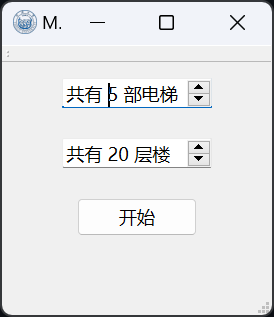

项目同步放在 [GitHub](https://github.com/meoowny/Elevator_emulator) 上。

# 项目背景分析

项目将实现一个电梯系统的模拟，以体会操作系统的调度过程，并学习特定环境下多线程编程的方法。

该电梯系统共有二十层楼和五部电梯（可设置），当乘客按下电梯按钮时，就创建了一个电梯移动的任务；五部运行的电梯则相当于处理器，用于处理产生的任务。我们需要采用合适的调度策略来完成所有任务。

# 项目简介

## 项目结构介绍

- `assets/`：项目资源文件，主要是应用图标；
- `src/`：项目源码及 UI 文件；
- `dist/`：项目可执行文件及其运行环境；
- `xmake.lua`：项目构建文件。

## 界面说明

- 主界面：项目运行后进入该界面，可以选择需要模拟的楼层数与电梯数量；
- 电梯界面：包括左侧各个电梯内的按键与最右侧的电梯外键；
- 电梯状态显示：各电梯内按键上方显示该电梯当前所在楼层、电梯运行方向与电梯状态（由楼层显示左右的颜色指示），运行状态说明如下：
    - 灰色: 电梯正常且空闲，处于关门状态；
    - 绿色: 电梯正常且处于开门状态；
    - 橙色: 电梯正常且正在移动；
    - 红色: 电梯损坏，等待修复。

## 功能说明

- 进入程序主界面后，选择需要模拟的楼层数与电梯数量，点击“运行”开始模拟；
- 点击电梯内任意数字按键发出请求，电梯在正常状态下将移动至请求楼层；
- 电梯空闲状态下，点击开门按键可使电梯开门一段时间。若重复按开门键，开门时间不会累积；
- 电梯开门状态下，点击关门按键可使电梯直接关门，若有目标楼层正在等待则移动至目标楼层，若无目标楼层则进入空闲状态；
- 任意状态下，点击报警按键会使电梯进入损坏状态。电梯损坏时，再次点击报警按键恢复（该功能仅为方便电梯的模拟而设置）。

# 开发环境

- 操作系统：Windows11
- 开发语言：C++17
- 构建工具：xmake
- 编译与链接工具：VS2022
- GUI 框架：Qt6.6.3

# 运行方式

该项目使用 windeployqt 打包了所需的动态链接库，双击运行 dist 目录下的 osLab1.exe 即可开始运行程序。

# 项目架构

项目由两个主要的类组成：`Elevator` 与 `Controller`。

其中 `Elevator` 包含了单个电梯的界面与运行逻辑，`Controller` 由 `Elevator` 数组与电梯外按键组成。

此外 `ElevatorButton` 类可以创建电梯按键，用于绑定电梯运行事件相关的信号与槽；`Semaphore` 是使用 STL 库的互斥量和条件变量实现的信号量，用于实现线程间互斥；`MainWindow` 仅用于创建程序初始界面，进行电梯模拟系统的设置。

## 类设计

### ElevatorButton

继承自 QPushButton，但包含如下成员变量、信号和槽函数，专门用于创建电梯按钮发送任务请求：
```cpp
signals:
  void newTarget(int floor, Direction dir = TARGET); // 给电梯发送新的任务请求
public slots:
  void onClick();       // 用于触发 newTarget 信号来给 Elevator 发送任务请求，并改变按键状态
  void onArrive(int f); // 这两个函数用于改变按键状态
  void lightupOnly();
private:
  const int floor;           // 当前按键对应的楼层
  const Direction dir;       // 当前按键指示的方向，主要用于电梯外按键
  std::atomic<bool> waiting; // 当前按键是否已被按下（代表任务是否正在等待中）
```

其中方向（Direction）共有三种可能取值：`UP` | `DOWN` | `TARGET`（已到达目标楼层后处于空闲状态）

### Controller

`Controller` 类作为电梯总的主控，用于响应电梯外按键的请求并分配新任务给某一电梯。包含如下成员变量：
```cpp
const int total_floor;    // 总楼层
const int total_elevator; // 电梯数量

Elevator **elevators;     // 各电梯
ElevatorButton **buttons; // 电梯外按键
QLabel **labels;          // 楼层标识
```

其中底楼的向下按键和顶楼的向上按键被禁用。

只有一个槽函数，与电梯外按键绑定，用于决定将新任务分配给哪个电梯：
```cpp
void newTarget(int floor, ElevatorButton::Direction dir);
```

关于该函数的调度逻辑见下一章节“调度算法设计”。

### Elevator

`Elevator` 类用于模拟单部电梯的运行，包含如下成员变量（UI 相关成员省略，`ElevatorButton` 数组也未展示），对于非常量成员使用原子变量存储，避免冲突：
```cpp
const int id;                                     // 电梯编号
const int total_floor;                            // 电梯总楼层数
std::atomic<State> state;                         // 当前电梯状态
std::atomic<int> current_floor;                   // 当前电梯层数
std::atomic<int> waiting_target;                  // 用于指示当前是否还有任务未处理
std::atomic<ElevatorButton::Direction> direction; // 电梯运行状态
```

模型中电梯共有 4 种运行状态（State）：`RUNNING`（移动中） | `WAITING`（空闲） | `OPENED`（开门） | `BROKEN`（关门）

此外 `Elevator` 中使用如下成员处理多线程间的同步互斥：
```cpp
Semaphore door_semaphore;   // 确保开门动作与移动任务间的互斥
std::mutex work_mutex;      // 确保移动任务间的互斥
std::timed_mutex open_door; // 用于实现开关门逻辑，开门时阻塞线程一段时间，关门时直接解锁即可
```

有如下两个信号：
```cpp
void changeState(TaskState state); // 电梯切换运行状态时，用于跨线程更新 UI 状态与电梯状态
void arrive(int floor);            // 电梯到达目标楼层后，用于跨线程更新 UI 状态与电梯状态
```

有如下五个槽函数：
```cpp
void onNewTarget(int floor);  // 绑定到 ElevatorButton 的 newTarget 信号，用于新增任务

// 开关门逻辑处理函数
void on_OpenDoor_clicked();  // 绑定到“开门”按钮
void on_CloseDoor_clicked(); // 绑定到“关门”按钮

// 以下函数均用于跨线程更新 UI 状态
void on_AlarmButton_clicked();    // 绑定到“报警”按钮
void onStateChange(TaskState st); // 绑定到 changeState 信号
```

有如下几个电梯运行逻辑相关函数：
```cpp
void moveTo(int n);   // 模拟电梯移动，逐层调用 step，到达目标楼层后调用 waitPassenger
void openDoor();      // 模拟电梯开门，获取 door_semaphore 信号量后调用 waitPassenger
void step(bool isUp); // 模拟电梯的单层移动，通过 sleep_for 让线程休眠一段时间
void waitPassenger(); // 模拟电梯开门等待乘客，通过 try_lock_for 阻塞线程一定时间来实现
void nextFloor();     // 电梯到达目标楼层后查找下一个目标楼层，在此处实现调度算法
```

当有得到新任务时，首先会通过信号或直接调用 `onNewTarget` 函数，由该函数新建线程执行任务：
```cpp
void Elevator::onNewTarget(int floor)
{
  // 电梯损坏不进行处理
  if (state == BROKEN)
    return;
  // 目标楼层与当前楼层相同且处于开门状态则直接发送 arrive 信号更新按键状态
  if (floor == current_floor and state == OPENED) {
    emit arrive(floor);
    return;
  }
  // 新建一个等待中的任务
  buttons[floor - 1]->lightupOnly();
  // 若此时电梯在运行，则让任务继续等待，否则新建线程执行任务
  if (work_mutex.try_lock()) {
    std::thread(&Elevator::moveTo, this, floor)
      .detach();
  }
}
```

执行移动任务时，逐楼层进行移动，如果到达了某一目标楼层（可能是等待任务的目标楼层），则结束移动，原目标楼层进入等待状态。结束移动后发送相关信号，并开门等待乘客进入电梯，然后释放相关锁，查找下一个任务。相关代码如下：
```cpp
void Elevator::moveTo(int floor)
{
  door_semaphore.wait();

  // 逐楼层移动，中途遇到报警则释放信号量并终止
  emit changeState(START);
  bool isUp = floor > current_floor;
  direction = isUp ? ElevatorButton::UP : ElevatorButton::DOWN;
  for (int i = current_floor; isUp and i < floor or not isUp and i > floor;) {
    if (state == BROKEN) {
      door_semaphore.signal();
      work_mutex.unlock();
      return;
    }
    step(isUp);
    i += isUp ? 1 : -1;

    // 若当前层有在等电梯，则直接开门并将当前层作为目标层
    if (buttons[i - 1]->isWaiting()) {
      floor = i;
      break;
    }
  }
  emit changeState(END);

  // 移动到目标楼层后向按钮发送状态更新的信号
  emit arrive(floor);

  if (state == BROKEN) {
    door_semaphore.wait();
    work_mutex.unlock();
    return;
  }
  // 到达目标楼层后开门一段时间等待乘客
  emit changeState(OPEN);
  waitPassenger();
  emit changeState(CLOSE);

  door_semaphore.signal();
  work_mutex.unlock();

  // 任务执行结束后查看是否还有未处理的任务
  nextFloor();
}
```

其中 `nextFloor` 的调度逻辑见下一章节“调度算法设计”。开关门与报警功能的具体实现见 `elevator.cpp` 代码。

## 调度算法设计

对于电梯内按键创建的请求，请求将直接由 `Elevator` 执行；对于电梯外按键创建的请求，由 `Controller` 分配新建任务给某一电梯，然后由该电梯执行。

即对于电梯内请求只涉及单电梯的调度，电梯外请求先由多电梯调度进行分配，然后由单电梯调度决定何时执行。

### 多电梯调度策略

由 `Controller` 的 `newTarget` 方法实现，获取新任务请求后选择一个电梯分配任务，其它电梯不响应该任务请求。

当获得新的任务请求后首先查看是否有电梯将会到达该楼层。如果有电梯 A 将到达该楼层，则不分配，由电梯 A 执行该任务。

如果没有电梯将到达该楼层，则查找所有运行方向上有该楼层的电梯和空闲的电梯，从中找出距离最短的电梯分配任务。

如果没有电梯运行方向上有该楼层，则从剩余电梯中找出距离最短的电梯分配任务。

代码实现见 `Controller.cpp`。

### 单电梯调度策略

由 `Elevator` 类的 `nextFloor` 方法实现，当一个任务处理完后进行调用，用于查找下一个需要执行的任务。

首先查找当前运行方向上是否还有未处理任务。如果当前运行方向上有未处理任务，挑选最近楼层执行任务。否则查看另一方向上是否还有未处理任务。

如果所有任务都已完成，则置运行方向为 `TARGET`（空闲状态下的方向）。

这样可以保证电梯在移动方向上仍有任务时不转向，避免了饥饿问题。同时由于电梯是逐楼层按距离从近到远处理进行移动的，提高了运行效率。

代码实现见 `Elevator.cpp`。

# 运行展示




